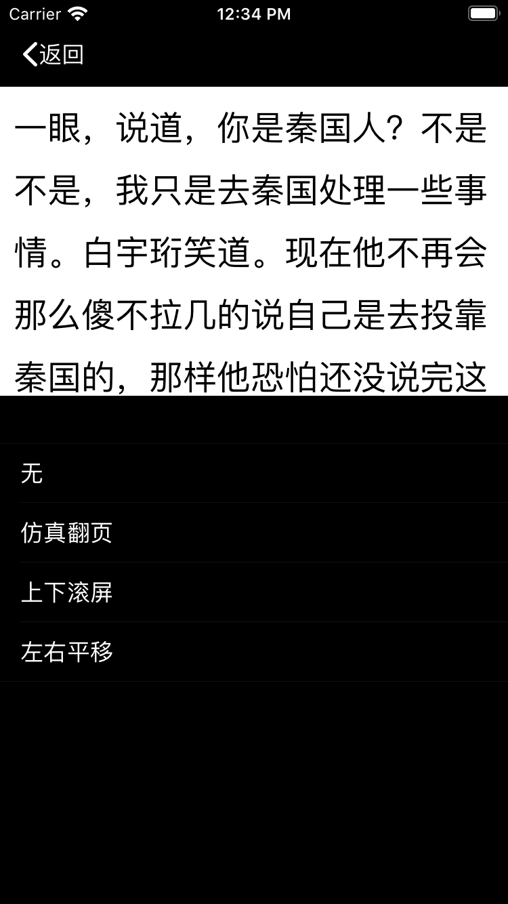

# ZDReader

**采用Swift语言编写的小说阅读器, 主要通过聚合搜索获取小说信息......**

**仅供学习交流，请勿用于商业用途**

## Requirements

- iOS 9.0+ / macOS 10.14+ / tvOS 9.0+ / watchOS 2.0+
- Xcode 10.2+
- Swift 5.0+

Main development of ZDReader olny support Swift 5.0+.

## Install

请执行以下两步操作，确保所有的依赖库安装完成后使用.

**CocoaPods:**

`$ pod install`

###Here you can see blow.

=======

###效果图如下：

## Contact

Follow and contact me on mail [2252055382@qq.com](https://mail.qq.com/). If you find an issue, just [open a ticket](https://github.com/NoryCao/zhuishushenqi/issues/new). Pull requests are warmly welcome as well.

## License

ZDReader is released under the MIT license. See LICENSE for details.

